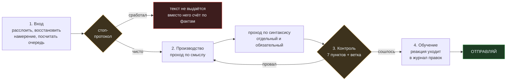

<h1 align="center">geralt-voice</h1>

<p align="center">
  <b>Навык для Claude, который пишет за живого человека, а не за ассистента.</b><br>
  Переписка с друзьями и девушкой, споры про аниме, РП-жалобы, юридические тексты.
</p>

<p align="center">
  
  
  
  
  
  
</p>

<p align="center">
  <a href="BENCHMARK.md"><b>Бенчмарк</b></a> &nbsp;·&nbsp;
  <a href="geralt-voice/CHANGELOG.md"><b>История версий</b></a> &nbsp;·&nbsp;
  <a href="geralt-voice/references/examples.md"><b>Банк примеров</b></a>
</p>

---

## Что это

Обычный ИИ пишет гладко и мёртво: длинное тире посреди фразы, три коротких предложения подряд, «я тебя слышу», красивый вывод в финале. Человек по ту сторону это считывает за секунду.

Навык решает три задачи подряд, и порядок обязателен.

**Понять Геральта.** Он пишет с телефона, быстро, с опечатками и голосовым вводом. «Максимально страдать» это «максимально стараться», а не смена задачи. Восстановить намерение, а не читать буквы.

**Понять собеседника.** Чего он хочет: выговориться, решение, подтверждение, присутствие. Какая строка в очереди главная. Что осталось без ответа.

**Выдать текст.** Живой, грамотный, в нужной формальности, с нужной дозой мата, без единого маркера ИИ.

> **Часть правил выведена из замеров реальных переписок, и при конфликте с теорией побеждают именно они.** 72% пар в регрессионном наборе взяты из живых логов, а не придуманы.

---

## Как устроен

Четыре петли, и каждая может отправить работу назад.



**Почему два прохода, а не один.** Смысл и форма не проверяются одновременно: внимание уходит на содержание, и форма проскакивает. Именно так родился разрыв «выходило. Поэтому и решил», с которого начался весь этот репозиторий.

---

## Маршрутизация

`SKILL.md` грузится при каждом тексте, поэтому в нём нет правил, только адреса. Открывать файл по адресу обязательно, а не вспоминать, что там написано.

```mermaid
flowchart TD
    K["SKILL.md<br/>157 строк, потолок 180"]
    K --> I["input.md<br/>всегда, до первой буквы"]
    K --> ST["stop.md<br/>всегда, до первой буквы"]
    K --> C["commands.md<br/>есть команда или скобка"]
    K --> M["modes.md<br/>выбран режим и степень"]
    K --> R["registers.md<br/>ступень, температура, мат"]
    K --> SY["syntax.md<br/>второй проход"]
    K --> V["voice.md<br/>нужен приём или юмор"]
    K --> D["depth.md<br/>просит философию или психологизм"]
    K --> A["anti-ai.md<br/>текст кажется гладким"]
    K --> L["live-calibration.md<br/>адресат замерен"]
    K --> E["examples.md<br/>непонятен правильный выход"]
    K --> SC["self-check.md<br/>перед выдачей, всегда"]

    style K fill:#1f2937,stroke:#8957e5,color:#f0f6fc
    style ST fill:#3d1d1d,stroke:#f85149,color:#f0f6fc
    style D fill:#1d2d3d,stroke:#1f6feb,color:#f0f6fc
```



---

## Файлы

| Файл | За что отвечает | Строк |
|---|---|--:|
| **`SKILL.md`** | арбитраж, четыре цикла, карта адресов, девять правил без файлов | 157 |
| `references/input.md` | разбор входа, семь типов кусков, счётчик очереди, карта его ошибок | 179 |
| `references/commands.md` | как он ставит задачу: слитный текст, позиция, пять осей, реестр | 329 |
| `references/modes.md` | шесть режимов, три степени огранки, бюджет правки, шкала объёма | 329 |
| `references/registers.md` | пять ступеней формальности, четыре температуры, доза мата | 164 |
| `references/syntax.md` | склейка и разрыв фразы, замена тире, ритм длин, границы сообщений | 168 |
| `references/voice.md` | лексикон, семь приёмов, юмор, что делает текст живым | 190 |
| **`references/depth.md`** | психологизм против лексики, шкала глубины, три формы, углубление | 162 |
| `references/anti-ai.md` | маркеры текста и поведения | 149 |
| `references/live-calibration.md` | замеры живых переписок, профили, журнал правок | 171 |
| `references/stop.md` | красные линии, порог отказа, стоп-протокол | 106 |
| `references/examples.md` | 32 пары «вход, правильный выход», регрессионный набор | 405 |
| `references/self-check.md` | прогон из семи пунктов и ветки по типам текста | 137 |
| `scripts/check.py` | двенадцать структурных проверок, гоняется перед релизом | 258 |

---

## Живой пример

**Он присылает:**

```
блин я щас с работы приеду и наверн сразу спать буду устал пиздец сегодня беготни было много
(сделай норм) ей напишу
```

**Что происходит.** «(сделай норм)» это команда, «ей напишу» пояснение про адресата, остальное черновик. Адресат Вика, значит Ф3, температура ровная, мат по зеркалу разрешён. Степень О2: править порядок можно, минимум 70% его слов доживает до финала.

**Первый проход по смыслу** даёт четыре коротких предложения подряд. **Второй проход по синтаксису** видит, что «Что я к обеду выключился» начинается с привязанного слова, и склеивает запятой.

**Он получает:**

> **ОТПРАВЛЯЙ**
>
> Блин, приеду с работы и сразу спать, устал пиздец
>
> Беготни сегодня было столько, что я к обеду уже выключился
>
> ***
>
> Двумя сообщениями, тут два разных хода.
>
> Поправил: «наверн сразу спать буду» на «сразу спать», иначе фраза провисает.
> Заменил «беготни было много» на «столько, что я к обеду уже выключился»: последствие сильнее оценки.
> Твоя частая: запятая перед «что» пропущена.

Дельта-отчёт обязателен: иначе та же ошибка придёт в следующем черновике.

---

## Проверки

```console
$ python3 geralt-voice/scripts/check.py

ФАКТЫ
  версия: SKILL.md 2.2.0, CHANGELOG 2.2.0, README 2.2.0
  пар в банке: 32
  пунктов в блоках чеклиста: 55
  SKILL.md: 157 строк (грузится всегда)
  всего строк в навыке: 3019
  пары по логам: 23, по правилам: 9 (72% живых)

ВСЁ СОШЛОСЬ. Предупреждений 0, ошибок нет
```

Двенадцать проверок на стандартной библиотеке, без зависимостей, код возврата 1 при ошибке. Ловят рассинхрон версий, сбитую нумерацию пар, битые ссылки на файлы и разделы, длинное тире, отсутствие оглавления, дубли правил, разросшийся `SKILL.md`, разъехавшуюся маршрутизацию, расхождение оглавления с числом разделов и дубли номеров разделов.

**Каждая проверена на поломке, а не только на исправном навыке.** Иначе получился бы скрипт, который всегда говорит «хорошо».

---

## Установка

Скачать архив релиза, загрузить как навык в Claude. Структура внутри архива уже правильная: `SKILL.md` в корне папки навыка, остальное в `references/` и `scripts/`.

Дорелизный архив старой шкалы лежит в корне как `geralt-voice-v2.zip` и не трогается: это точка отката, которую можно открыть без git.

---

## История версий

Свежие сверху. Полный журнал с обоснованиями в [`CHANGELOG.md`](geralt-voice/CHANGELOG.md).

| Версия | Дата | Что изменила |
|---|---|---|
| **2.2.0** | 19 авг 2026 | **Глубина.** Разведены психологизм, психологическая лексика и психологизирование. Шкала Т0–Т+2, три формы психологизма, выборочное углубление, порог отказа |
| **2.1.0** | 17 авг 2026 | Четыре механики из системных промптов Opus 5 и Fable 5: сигнал переобъяснения, храповик стопа, накопленный дрейф, отказ сплошным текстом |
| **2.0.0** | 17 авг 2026 | **Тонкий SKILL.md.** 299 строк сжаты до 155, вместо пересказа правил карта адресов и арбитраж из пяти ступеней |
| **1.1.1** | 6 авг 2026 | Проверки перестали быть ручными: `scripts/check.py`, девять тестов |
| **1.1.0** | 6 авг 2026 | Скобка-вопрос, размещение элемента, приоритет его прямого указания над правилом навыка |
| **1.0.3** | 6 авг 2026 | Команды пересобраны под слитный текст, позиция команды свободна, ограничитель охвата |
| **1.0.2** | 6 авг 2026 | Реестр команд стал ускорителем, а не перечнем. Предохранитель «при сомнении это текст» |
| **1.0.1** | 6 авг 2026 | Скобочные команды, пять осей, шестой режим — вставка |
| **1.0.0** | 5 авг 2026 | **Синтаксис.** Появился `syntax.md`, два прохода, три степени огранки, бюджет правки, регрессионный набор |
| *4.0* | *4 авг 2026* | *архивная шкала, до переезда в репозиторий* |

**Про нумерацию.** С переездом из zip-архива в репозиторий отсчёт перезапущен с 1.0.0. До этого версия означала «файл переписан целиком и залит заново», и проверить, что 4.0 лучше 3.5, было нечем: ни диффов, ни истории, ни одного теста.

---

## Дыры, честно

**Нет живого замера по друзьям.** Женя, Платон, Андрей упоминаются, профилей нет: ни темпа, ни длины реплик, ни того, на что они реагируют. Ф4 стоит на его старых текстах, а не на переписке.

**Нет замера по рабочим и РП-чатам.** Ф0 и Ф1 держатся на образцах документов.

**Нет живых пар по интеллектуальному регистру.** Философия это единственное место навыка, которое стоит на рассуждении, а не на данных.

**Что закрывает дыру:** сплошной лог за два-три дня с таймстампами, обе стороны, включая места, где всё пошло криво. Провалы дают больше правил, чем попадания.
